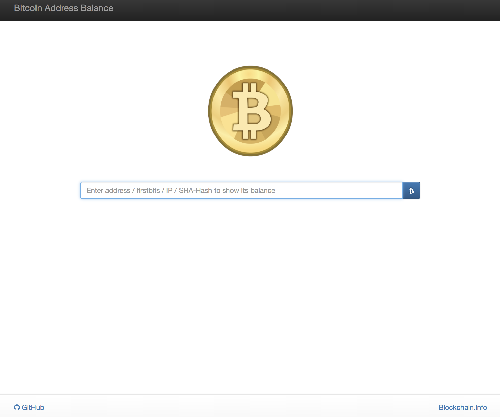

# Bitcoin Address Balance

This project implements a web page to show the balance of a Bitcoin address.

It is reading the balance data for a Bitcoin address via [Blockchain.info](https://blockchain.info) provider.

## Getting Started

Clone the GIT repository and add it to your CodeKit software. It is planned
to remove CodeKit and use a standard automation script.

### Prerequisites

At the moment you need to have CodeKit installed. This requirment will be
changed soon.

## Built With

* [Atom](https://atom.io/) - Editor
* [CodeKit](https://codekitapp.com/) - Web Project Tool

## Contributing

Please read [CONTRIBUTING.md](https://gist.github.com/PurpleBooth/b24679402957c63ec426) for details on our code of conduct, and the process for submitting pull requests to us.

## Versioning

We use [SemVer](http://semver.org/) for versioning. For the versions available, see the [tags on this repository](https://github.com/your/project/tags).

## Authors

* **[Marco Koch](https://github.com/markoch)** - *Initial work*

## License

This project is licensed under the MIT License - see the [LICENSE.md](LICENSE.md) file for details
